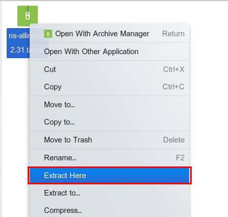

# Instructions

1. Download [ns-allinone-2.31.tar.gz](ns-allinone-2.31.tar.gz)

2. Right Click on the file and click `Extract Here`.

    

3. You'll get a folder `ns-allinone-2.31` with all the required files.

4. Instructions to install ns-2 are available [here](https://www.absingh.com/ns2/).