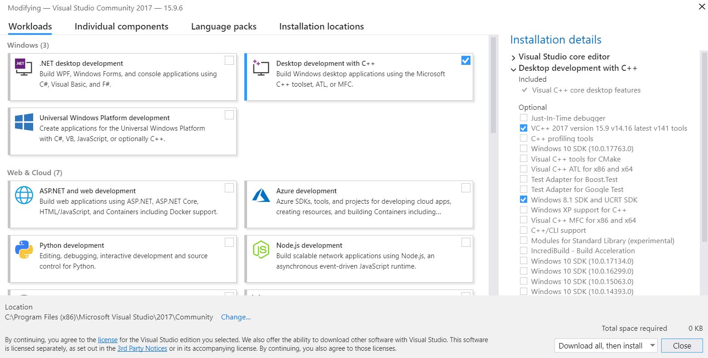

# Installation

Use the following instructions to setup **OpenGL** with **Visual Studio Community 2017** on **Windows 10**:

1. Install **Visual Studio Community 2017** using the official [installer](https://visualstudio.microsoft.com/vs/) with the required components as shown in the image below.

    

2. Download GLUT header, lib, and dll files from [OpenGL](https://www.opengl.org/resources/libraries/glut/glutdlls37beta.zip). (Mentioned on [this](https://www.opengl.org/resources/libraries/glut/glut_downloads.php) page)

3. Paste `glut.h` in `C:\Program Files (x86)\Microsoft Visual Studio\2017\Community\VC\Tools\MSVC\{14.16.27023}\include\GL`.

    Create the GL folder if not present already. The {version} may differ on your system.

4. Paste `glut.lib` in `C:\Program Files (x86)\Microsoft Visual Studio\2017\Community\VC\Tools\MSVC\{14.16.27023}\lib\x64`. 

    Paste `glut32.lib` in `C:\Program Files (x86)\Microsoft Visual Studio\2017\Community\VC\Tools\MSVC\{14.16.27023}\lib\x86.` The {version} may differ on your system.

5. Paste `glut.dll` and `glut32.dll` in `C:\Windows\SysWOW64`.

    Copy `glut32.dll` to `C:\Windows\System32` also.

6. Open your `Windows Console Application` project in `Visual Studio`, or create a new one:
    
    File > New > Project  
    Visual C++ > Windows Desktop > Windows Console Application

7. Go to `Project > Properties`.

    Select `All Configuration` from `Configuration` dropdown menu on top left corner.

    Select `Configuration Properties > C/C++ > Precompiled headers` and change `Precompiled Header` option's value to `Not Using Precompiled Headers`.

    Select `Configuration Properties > Linker > Input`. Now right click on `Additional Dependencies` found on right panel and click **Edit**.

    Now type:
    ```
    opengl32.lib
    glu32.lib
    glut32.lib
    ```
    (**Note**: Each .lib in new line)

8. That's it. You have successfully installed OpenGL. Go on and run your program.

Same installation instructions apply to freeglut files with the header files in the GL folder, lib in the lib folder, and dll in the System32 folder.